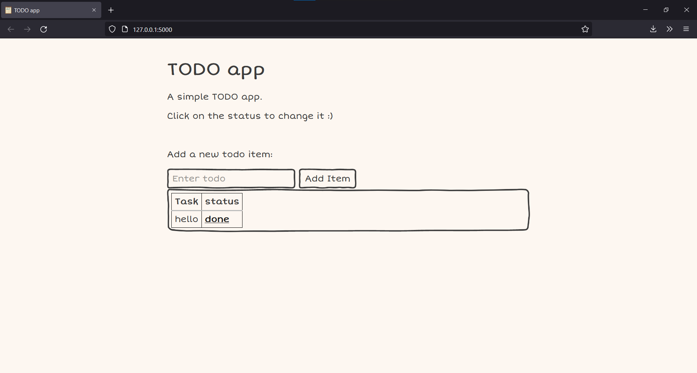

# TODO app



This is a simple TODO app made using Flask.

## Setup and run

Make sure you have python inslled

1. Set up virtualenv
    ```bash
    $ virtualenv venv
    ```
2. Activate venv
    ```bash
    $ source venv/scripts/activate
    ```
3. Install required modules
    ```bash
    pip install -r requirements.txt
    ```
4. Run!
    ```bash
    python run.py
    ```